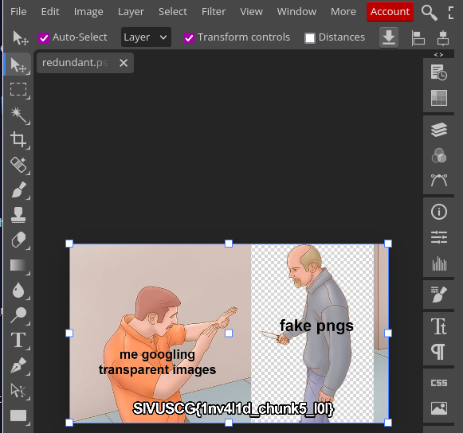

# Writeups for the [2024 US Cyber Open](https://www.uscybergames.com/)

I test AI so I contacted the leaders of the US Cyber Open and asked if using Microsoft Copilot would be cheating.  I was told that I could use any tool including Copilot.  Some of these writeups include my conversations with Copilot.  

## Beginner

[Secret - Forensics](secret.md)

[I want to believe - Forensics](i_want_to_believe.md)

[Flag checker - Reverse Engineering](flag_checker.md)

[You have mail](you_have_mail.md)

[Email where it happens](email_where_it_happens_pcap.md)

[Baby's First Crypto - Cryptography](babys_first_rsa_crypto.md)

[Diffie Hellman - Cryptography](diffie_hellman.md)

[Container Chronicles](partial_container_chronicles.md)

[Flag Hunt - Web](partial_hunt.md)

## Competitive

### Redundant
After running exiftool to check the file, I opened it in [Photopea](https://www.photopea.com/) and found the flag.  SIVUSCG{1nv41d_chunk5_101}

---
Note:  In some cases, Copilot provided references with links.  Unfortunately, I inadvertently failed to save some of these reference URLs.

